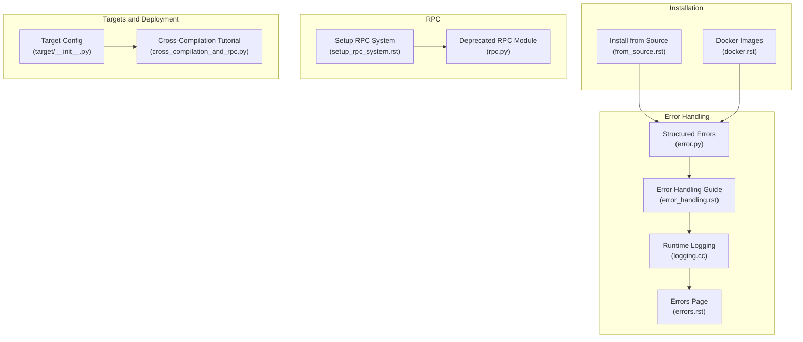
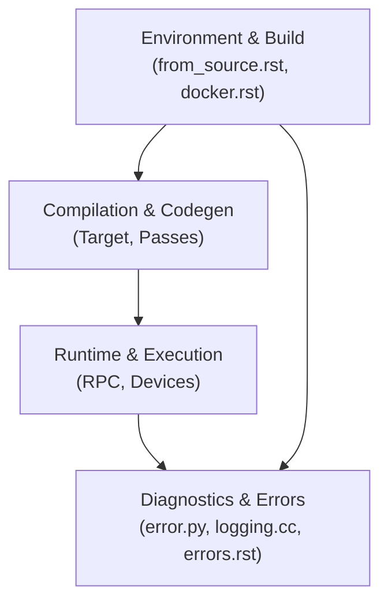
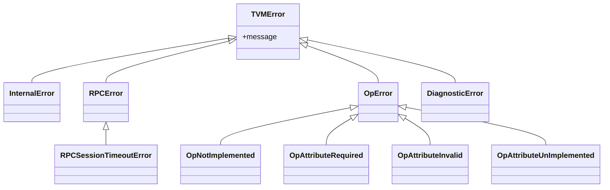
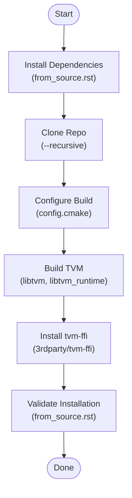
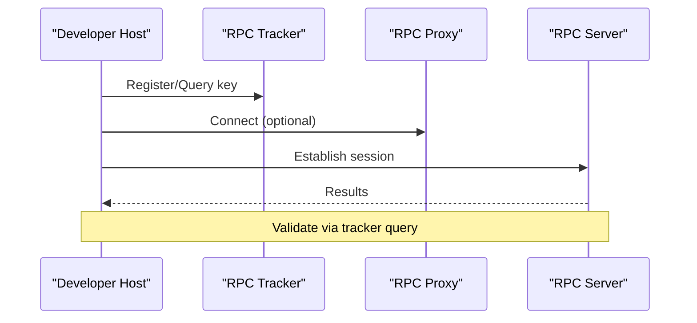
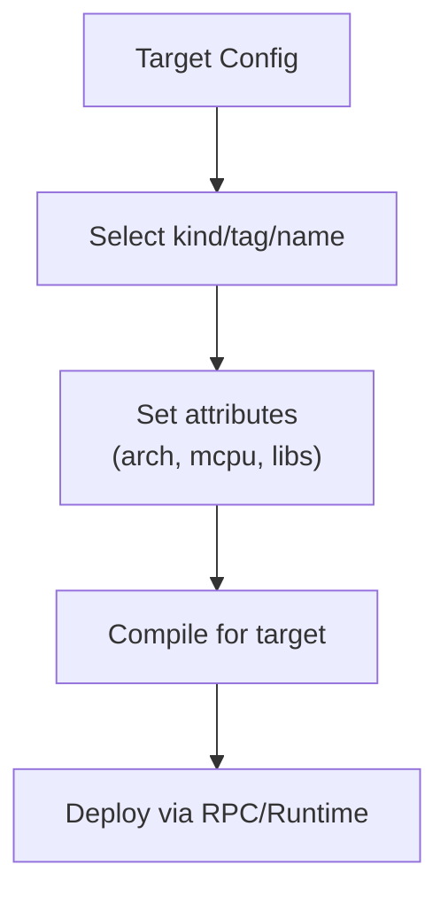
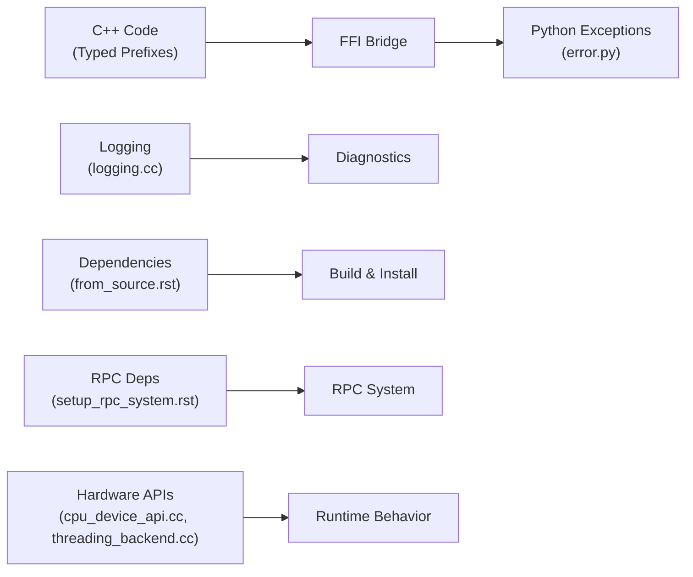

# Troubleshooting and FAQ

<cite>
**Referenced Files in This Document**
- [errors.rst](file://docs/errors.rst)
- [error_handling.rst](file://docs/contribute/error_handling.rst)
- [error.py](file://python/tvm/error.py)
- [logging.cc](file://src/runtime/logging.cc)
- [from_source.rst](file://docs/install/from_source.rst)
- [docker.rst](file://docs/install/docker.rst)
- [setup_rpc_system.rst](file://docs/how_to/dev/setup_rpc_system.rst)
- [rpc.py](file://python/tvm/contrib/rpc.py)
- [cpu_device_api.cc](file://src/runtime/cpu_device_api.cc)
- [threading_backend.cc](file://src/runtime/threading_backend.cc)
- [cross_compilation_and_rpc.py](file://docs/how_to/tutorials/cross_compilation_and_rpc.py)
- [__init__.py](file://python/tvm/target/__init__.py)
</cite>

## Table of Contents
1. [Introduction](#introduction)
2. [Project Structure](#project-structure)
3. [Core Components](#core-components)
4. [Architecture Overview](#architecture-overview)
5. [Detailed Component Analysis](#detailed-component-analysis)
6. [Dependency Analysis](#dependency-analysis)
7. [Performance Considerations](#performance-considerations)
8. [Troubleshooting Guide](#troubleshooting-guide)
9. [Conclusion](#conclusion)
10. [Appendices](#appendices)

## Introduction
This document provides a comprehensive troubleshooting and FAQ guide for TVM users. It covers common installation issues, compilation errors, runtime problems, debugging techniques, error message interpretation, systematic diagnosis, performance and memory issues, hardware compatibility, target configuration, optimization strategies, deployment scenarios, error handling and logging, and step-by-step guides for typical user scenarios. Platform-specific issues, dependency conflicts, and environment setup pitfalls are addressed, along with community resources, support channels, and contribution guidelines.

## Project Structure
This guide focuses on key areas of the repository that impact installation, compilation, runtime, error handling, logging, RPC, and performance diagnostics. The most relevant sources include:
- Installation and environment setup documentation
- Error handling and logging internals
- RPC system setup and validation
- Target configuration and deployment guidance
- Performance and hardware compatibility notes

**Diagram sources**
- [from_source.rst:1-353](file://docs/install/from_source.rst#L1-L353)
- [docker.rst:1-84](file://docs/install/docker.rst#L1-L84)
- [error.py:1-131](file://python/tvm/error.py#L1-L131)
- [error_handling.rst:1-98](file://docs/contribute/error_handling.rst#L1-L98)
- [logging.cc:1-160](file://src/runtime/logging.cc#L1-L160)
- [errors.rst:1-72](file://docs/errors.rst#L1-L72)
- [setup_rpc_system.rst:1-244](file://docs/how_to/dev/setup_rpc_system.rst#L1-L244)
- [rpc.py:1-29](file://python/tvm/contrib/rpc.py#L1-L29)
- [__init__.py:1-40](file://python/tvm/target/__init__.py#L1-L40)
- [cross_compilation_and_rpc.py:513-557](file://docs/how_to/tutorials/cross_compilation_and_rpc.py#L513-L557)

**Section sources**
- [from_source.rst:1-353](file://docs/install/from_source.rst#L1-L353)
- [docker.rst:1-84](file://docs/install/docker.rst#L1-L84)
- [error.py:1-131](file://python/tvm/error.py#L1-L131)
- [error_handling.rst:1-98](file://docs/contribute/error_handling.rst#L1-L98)
- [logging.cc:1-160](file://src/runtime/logging.cc#L1-L160)
- [errors.rst:1-72](file://docs/errors.rst#L1-L72)
- [setup_rpc_system.rst:1-244](file://docs/how_to/dev/setup_rpc_system.rst#L1-L244)
- [rpc.py:1-29](file://python/tvm/contrib/rpc.py#L1-L29)
- [__init__.py:1-40](file://python/tvm/target/__init__.py#L1-L40)
- [cross_compilation_and_rpc.py:513-557](file://docs/how_to/tutorials/cross_compilation_and_rpc.py#L513-L557)

## Core Components
- Error handling and structured exceptions: TVM defines specific error classes mapped to Python exceptions and uses typed prefixes in C++ to propagate precise error categories.
- Logging and diagnostics: TVM’s runtime logging supports configurable verbosity and integrates with FFI stack traces.
- Installation and environment: Clear dependency lists, platform-specific notes, and validation steps for successful builds and installations.
- RPC system: Guidance for tracker/proxy/server setup, validation, and common device-side issues.
- Target configuration: JSON-based target descriptors, tags, and attributes for deployment across diverse hardware.

**Section sources**
- [error.py:1-131](file://python/tvm/error.py#L1-L131)
- [error_handling.rst:1-98](file://docs/contribute/error_handling.rst#L1-L98)
- [logging.cc:1-160](file://src/runtime/logging.cc#L1-L160)
- [from_source.rst:28-228](file://docs/install/from_source.rst#L28-L228)
- [setup_rpc_system.rst:178-244](file://docs/how_to/dev/setup_rpc_system.rst#L178-L244)
- [__init__.py:18-32](file://python/tvm/target/__init__.py#L18-L32)

## Architecture Overview
The troubleshooting architecture centers on diagnosing issues across four layers:
- Environment and build: Installation, dependencies, and platform specifics
- Compilation and code generation: Target selection, passes, and diagnostics
- Runtime and execution: RPC connectivity, device detection, and memory/threading behavior
- Diagnostics and error propagation: Structured errors, logging, and user-facing guidance

**Diagram sources**
- [from_source.rst:1-353](file://docs/install/from_source.rst#L1-L353)
- [docker.rst:1-84](file://docs/install/docker.rst#L1-L84)
- [error.py:1-131](file://python/tvm/error.py#L1-L131)
- [logging.cc:1-160](file://src/runtime/logging.cc#L1-L160)
- [errors.rst:1-72](file://docs/errors.rst#L1-L72)

## Detailed Component Analysis

### Error Handling and Logging Internals
- Structured error classes: TVMError and specialized subclasses (e.g., InternalError, RPCError, RPCSessionTimeoutError, OpError family) enable targeted handling.
- Typed prefixes in C++ propagate to Python exceptions automatically via the FFI system, combining C++ and Python stack traces.
- Logging: Runtime logging supports debug-level verbosity and VLOG filtering controlled by environment specs.

**Diagram sources**
- [error.py:32-131](file://python/tvm/error.py#L32-L131)

**Section sources**
- [error.py:1-131](file://python/tvm/error.py#L1-L131)
- [error_handling.rst:38-65](file://docs/contribute/error_handling.rst#L38-L65)
- [logging.cc:28-160](file://src/runtime/logging.cc#L28-L160)
- [errors.rst:34-72](file://docs/errors.rst#L34-L72)

### Installation and Environment Setup
- Dependencies: CMake, LLVM, Git, modern C++ compilers, Python, optional Conda.
- System dependencies on Ubuntu/Debian; conda environments for unified toolchains.
- Validation steps: locate Python package, confirm linked library, reflect build options, check device detection.
- Platform specifics: Windows path conventions, Ccache usage, CUDA/ROCm configuration notes.

**Diagram sources**
- [from_source.rst:30-228](file://docs/install/from_source.rst#L30-L228)

**Section sources**
- [from_source.rst:28-228](file://docs/install/from_source.rst#L28-L228)

### RPC System Setup and Validation
- Suggested architecture: tracker, proxy, and server; queueing and key-based management.
- Setup steps: tracker/proxy/server commands, cross-compilation notes, packaging/deployment, launch commands.
- Validation: query tracker for server list and queue status.
- Troubleshooting: missing numpy/cloudpickle on device; workarounds provided.

**Diagram sources**
- [setup_rpc_system.rst:38-176](file://docs/how_to/dev/setup_rpc_system.rst#L38-L176)

**Section sources**
- [setup_rpc_system.rst:178-244](file://docs/how_to/dev/setup_rpc_system.rst#L178-L244)

### Target Configuration and Deployment
- JSON-based target configuration supports dictionaries, tags, and overrides.
- Access target attributes (e.g., arch, max_num_threads, mcpu, libs) via target.attrs.
- Deployment guidance includes cross-compilation and RPC workflows.

**Diagram sources**
- [__init__.py:18-32](file://python/tvm/target/__init__.py#L18-L32)
- [cross_compilation_and_rpc.py:513-557](file://docs/how_to/tutorials/cross_compilation_and_rpc.py#L513-L557)

**Section sources**
- [__init__.py:18-32](file://python/tvm/target/__init__.py#L18-L32)
- [cross_compilation_and_rpc.py:513-557](file://docs/how_to/tutorials/cross_compilation_and_rpc.py#L513-L557)

## Dependency Analysis
- Error propagation: C++ typed prefixes map to Python exceptions through FFI; logging integrates with stack traces.
- Installation dependencies: CMake, LLVM, compilers, Python; optional extras for RPC/auto-tuning.
- RPC dependencies: tornado for tracker, cloudpickle for server packaging.
- Hardware detection: CPU memory queries and threading backends vary by platform.

**Diagram sources**
- [error.py:1-131](file://python/tvm/error.py#L1-L131)
- [logging.cc:1-160](file://src/runtime/logging.cc#L1-L160)
- [from_source.rst:28-228](file://docs/install/from_source.rst#L28-L228)
- [setup_rpc_system.rst:245-256](file://docs/how_to/dev/setup_rpc_system.rst#L245-L256)
- [cpu_device_api.cc:60-109](file://src/runtime/cpu_device_api.cc#L60-L109)
- [threading_backend.cc:297-328](file://src/runtime/threading_backend.cc#L297-L328)

**Section sources**
- [from_source.rst:28-228](file://docs/install/from_source.rst#L28-L228)
- [setup_rpc_system.rst:245-256](file://docs/how_to/dev/setup_rpc_system.rst#L245-L256)
- [cpu_device_api.cc:60-109](file://src/runtime/cpu_device_api.cc#L60-L109)
- [threading_backend.cc:297-328](file://src/runtime/threading_backend.cc#L297-L328)

## Performance Considerations
- Auto-tuning with MetaSchedule and quick optimization with DLight are recommended for target-specific performance.
- Architecture-specific flags (e.g., NEON, AVX-512, RISC-V vector) can be applied via target configuration.
- Threading and CPU frequency awareness influence runtime scheduling on various platforms.

**Section sources**
- [cross_compilation_and_rpc.py:513-557](file://docs/how_to/tutorials/cross_compilation_and_rpc.py#L513-L557)
- [threading_backend.cc:297-328](file://src/runtime/threading_backend.cc#L297-L328)

## Troubleshooting Guide

### Installation and Environment Issues
Common symptoms and resolutions:
- Missing system dependencies on non-conda setups (Ubuntu/Debian example provided).
- Incorrect or conflicting LLVM versions causing symbol visibility or ABI issues.
- Validation failures indicating wrong library linkage or mismatched build flags.
- Windows path conventions and generator/compiler setup requirements.

Resolution steps:
- Install required system packages and use conda environments for consistent toolchains.
- Verify linked library and build options reflect intended configuration.
- Follow Windows-specific notes for path separators and generators.

**Section sources**
- [from_source.rst:46-228](file://docs/install/from_source.rst#L46-L228)

### Compilation Errors
Common causes and fixes:
- Incorrect CMake configuration or missing flags (e.g., LLVM, CUDA/Metal/Vulkan/OpenCL toggles).
- Symbol visibility conflicts with other frameworks; enable HIDE_PRIVATE_SYMBOLS.
- Cross-compilation toolchain misconfiguration.

Resolution steps:
- Review and adjust config.cmake entries; rebuild cleanly.
- Enable HIDE_PRIVATE_SYMBOLS to mitigate symbol conflicts.
- Ensure cross-compilation toolchain matches target platform.

**Section sources**
- [from_source.rst:96-151](file://docs/install/from_source.rst#L96-L151)
- [from_source.rst:130-140](file://docs/install/from_source.rst#L130-L140)

### Runtime Problems and RPC Connectivity
Common symptoms and fixes:
- RPC server fails to launch due to missing numpy/cloudpickle on device.
- Tracker/proxy/server connectivity issues; verify ports and keys.
- Device detection failures (e.g., CUDA/Metal/Vulkan) despite correct toolchains.

Resolution steps:
- Create minimal dummy numpy stub or install cloudpickle on device.
- Validate tracker status and queue; ensure correct host/port/key combinations.
- Confirm device detection and driver availability; remember compiler can run without physical device.

**Section sources**
- [setup_rpc_system.rst:178-244](file://docs/how_to/dev/setup_rpc_system.rst#L178-L244)
- [from_source.rst:217-228](file://docs/install/from_source.rst#L217-L228)

### Error Messages and Diagnostics
Interpretation tips:
- Internal invariant violations trigger a standardized error page with guidance.
- Typed prefixes in C++ map to specific Python exceptions; use them for precise error handling.
- Logging verbosity and VLOG filtering aid in isolating problematic components.

Resolution steps:
- Search the community forum for your error; include version, hardware, target, and repro details.
- Use structured errors and typed prefixes to write robust handlers.
- Increase logging verbosity for deeper diagnostics.

**Section sources**
- [errors.rst:22-72](file://docs/errors.rst#L22-L72)
- [error_handling.rst:38-65](file://docs/contribute/error_handling.rst#L38-L65)
- [logging.cc:63-125](file://src/runtime/logging.cc#L63-L125)

### Performance and Memory Issues
Common symptoms and fixes:
- Suboptimal kernel performance on target hardware.
- Excessive memory usage or allocation failures.
- Threading contention or CPU affinity mismatches.

Resolution steps:
- Apply MetaSchedule auto-tuning or DLight default schedules.
- Use architecture-specific flags in target configuration.
- Investigate memory allocation paths and threading backend behavior.

**Section sources**
- [cross_compilation_and_rpc.py:513-557](file://docs/how_to/tutorials/cross_compilation_and_rpc.py#L513-L557)
- [cpu_device_api.cc:95-109](file://src/runtime/cpu_device_api.cc#L95-L109)
- [threading_backend.cc:297-328](file://src/runtime/threading_backend.cc#L297-L328)

### Hardware Compatibility Problems
Common symptoms and fixes:
- Device not detected by runtime.
- Driver/library path issues on device.
- Platform-specific memory alignment or threading behavior.

Resolution steps:
- Confirm device detection and driver presence.
- Ensure LD_LIBRARY_PATH and runtime libraries are discoverable.
- Account for platform differences in memory allocation and CPU frequency handling.

**Section sources**
- [from_source.rst:217-228](file://docs/install/from_source.rst#L217-L228)
- [cpu_device_api.cc:60-109](file://src/runtime/cpu_device_api.cc#L60-L109)
- [threading_backend.cc:297-328](file://src/runtime/threading_backend.cc#L297-L328)

### Target Configuration FAQs
- How do I select a target? Use JSON descriptors, tags, or kind names; override attributes as needed.
- How do I inspect target attributes? Access target.attrs for arch, max_num_threads, mcpu, libs, etc.
- How do I deploy to a remote device? Combine cross-compilation with RPC server and tracker/proxy as needed.

**Section sources**
- [__init__.py:18-32](file://python/tvm/target/__init__.py#L18-L32)
- [setup_rpc_system.rst:72-176](file://docs/how_to/dev/setup_rpc_system.rst#L72-L176)

### Community Resources, Support, and Contribution
- Community forum for discussions and seeking help.
- Report issues with version, hardware/OS, target, and repro details.
- Deprecated modules should be migrated to supported APIs.

**Section sources**
- [errors.rst:50-72](file://docs/errors.rst#L50-L72)
- [rpc.py:18-29](file://python/tvm/contrib/rpc.py#L18-L29)

## Conclusion
This guide consolidates practical troubleshooting strategies for TVM across installation, compilation, runtime, and deployment. By leveraging structured error handling, robust logging, validated environment setup, and RPC diagnostics, most issues can be systematically resolved. For persistent problems, use the community forum with detailed repro information and follow contribution guidelines for bug reports and feature requests.

## Appendices

### Quick Reference: Common Commands and Checks
- Validate installation and build reflection
  - Locate Python package and linked library
  - Print build options and device detection checks
- RPC validation
  - Query tracker for server list and queue status
- Docker usage
  - Launch container with mounted workspace and Jupyter accessibility

**Section sources**
- [from_source.rst:179-228](file://docs/install/from_source.rst#L179-L228)
- [setup_rpc_system.rst:150-176](file://docs/how_to/dev/setup_rpc_system.rst#L150-L176)
- [docker.rst:35-67](file://docs/install/docker.rst#L35-L67)